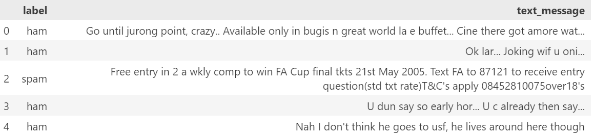
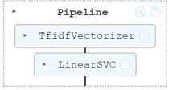
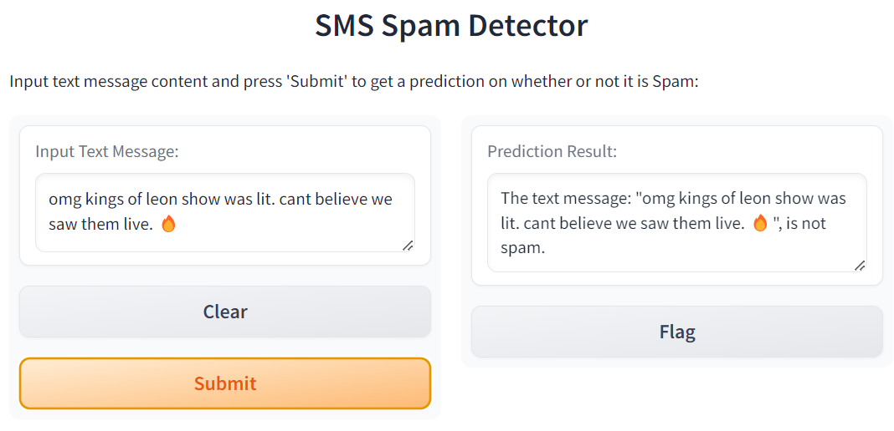
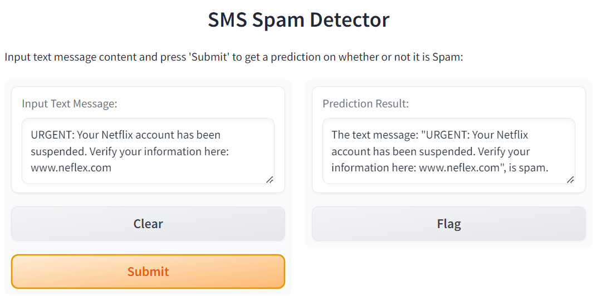

# SMS Spam Detection, Powered by Machine Learning

## Gradio SMS Classification Function Powered by a Support Vector Classification (SVC) Model

### I. Description:

Develop a Gradio applcation powered by a Support Vector Classification (SVC) model that will provide feedback to users, indicating whether entered text is classified as spam.

### II. Goals:

Refactor code from an SMS text classification solution into a function that constructs a linear Support Vector Classification (SVC) model.

Create a Gradio app to host the application, enabling users to test text messages.

### III. Data:

Git Repo: sms_spam_detector

Sample labeled data, with text_message and label (ham or spam):

   

### IV. Steps:

##### SMS Classification Function

Takes `sms_text_clf` test data, sets X (feature), y (target data), splits data into training and test sets, and returns the `text_clf` object, which is a `Pipeline` object.

The pipeline streamline the series of data processing steps including:

* **TF-IDF Vectorization** : converts the text data into numerical features using Term Frequency-Inverse Document Frequency (TF-IDF), which helps in transforming the text into a format that the machine learning model can understand `stop_words='english'` parameter removes common English words that are unlikely to be useful for classification.
* **Linear Support Vector Classification (SVC)** : a Support Vector Machine (SVM) classification model with a linear kernel, that has been trained on classifier that has been trained on the transformed training data and is used to classify the text messages

    

NOTE: *Function  `sms_classification` returns a fitted pipeline model for SMS classification (`text_clf` object, which is a `Pipeline` ) that includes the TF-IDF Vectorization to convert text messages into numerical features and a Linear Support Vector Classification (SVC) classification model, trained on the transformed training data.*

##### SMS Prediction Function

The `sms_prediction` function takes the text iterable (see below) and predict the classifications of text as SPAM or not.

It calles the Pipline predict method, then returns a message indicating whether the text is spam or not, based on the prediction of the classifier model.

    `prediction = text_clf.predict([text])`

NOTE: *The 'predict' method of the Pipeline (and many other scikit-learn models) expects an iterable (eg. list, array) as it is designed to handle batch predictions. It can process multiple text documents at once, even if you're only passing a single text message.*

* *The method is designed to handle both single & multiple inputs in a consistent manner.*
* *By always expecting an iterable, the method can uniformly process the input data.*
* *Batch Processing: ML models often make predictions on multiple samples at once; expecting an iterable allows the model to efficiently handle batch predictions.*
* *Data Transformation: The pipeline includes steps like TfidfVectorizer, which are designed to transform a collection of text documents into numerical features.*

### V. Introduce Gradio Interface Application

Create a web-based interface to allow users to enter a text message and get a prediction on whether it is spam or not.

Sample outputs:







```markdown

```
